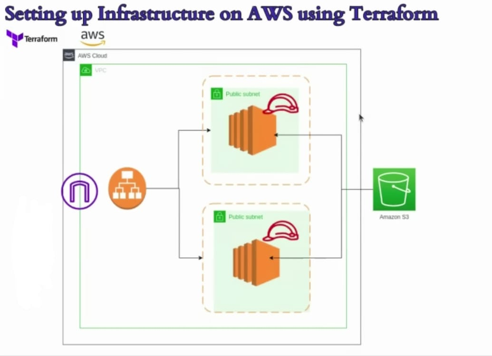

# AWS Infrastructure Setup Using Terraform

This project demonstrates the setup of a AWS infrastructure using **Terraform**. The architecture includes a **VPC**, **public subnets**, **EC2 instances**, an **S3 bucket**, and an **Application Load Balancer (ALB)** for high availability.  

---

## 📜 Overview

This infrastructure was created to automate the deployment of AWS resources using Terraform. The architecture includes:  

1. **Virtual Private Cloud (VPC):** The foundational network for resources.  
2. **Public Subnets:** Hosting EC2 instances accessible via the internet.  
3. **EC2 Instances:** Running web applications with CRUD access to the S3 bucket.  
4. **S3 Bucket:** For storing application data and assets.  
5. **Application Load Balancer (ALB):** Ensures high availability and distributes incoming traffic to EC2 instances.  



---

## ⚙️ Features

- Automated infrastructure deployment using Terraform.
- IAM roles for secure access to the S3 bucket.
- Load balancer integration for traffic distribution and fault tolerance.
- Custom bucket policy creation under the IAM module to resolve dependency issues.

---

## 🚧 Challenges Faced

While configuring the architecture, the following issue was encountered:  
- The **S3 module** required the ARN of the IAM role to create the bucket policy.  
- The **IAM module** needed the bucket name to create the role.  

### **Solution**  
The bucket policy creation was shifted from the **S3 module** to the **IAM module** after the IAM role was created, ensuring a smooth dependency resolution.

---

## 🚀 Getting Started

### Prerequisites
- **Terraform** installed on your local machine.
- AWS CLI configured with appropriate credentials.
- An AWS account to deploy the resources.

### Steps to Deploy
1. Clone the repository.  
   ```bash
   git clone <repository-url>
   cd <repository-folder>

2. Initialize Terraform.
   ```bash
   terraform init

3. Plan the deployment
   ```bash
   terraform plan

4. Apply the setup
   ```bash
   terraform apply

5. To destroy the resources
   ```bash
   terraform destroy
   
